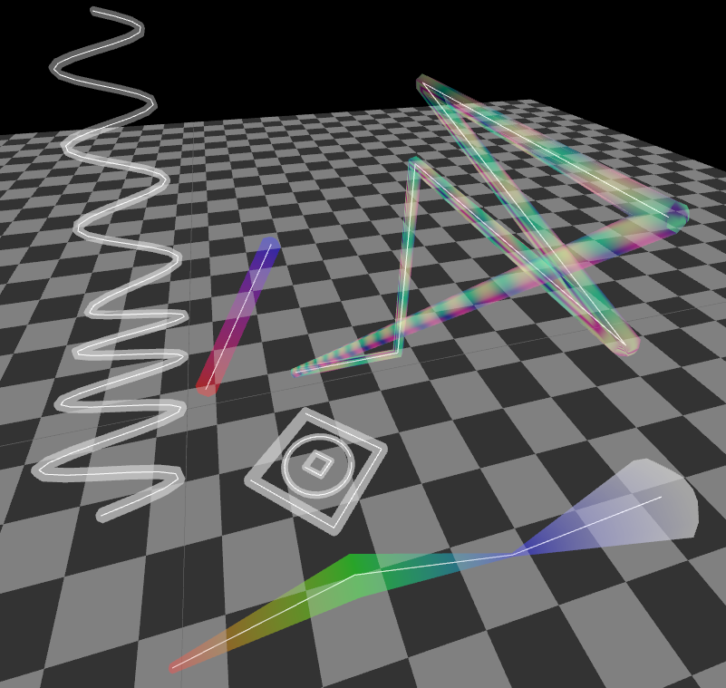

Line Mesh
===========



Generate a mesh from a path line formed by connecting 3D points

Supported lua version: `luajit`, `lua` 5.1 - 5.4, `luau`(Currently used for experience)

**Key Features**:

* Simple smoothing of sharp corners
* Support for setting color and radius for each point
* Support for closed paths
* Support UV
* Support generate mesh data by GPU(8x faster)


**TODO**:

* Supports append point to path


## Use

```lua
local points = { { 1, 0, 0 }, { 1, 1, 1 }, { 1, 0, 1 } }
local width = 0.1
local seg = 8 -- Generate by CPU, adding segments has a significant impact on performance.
-- vlist: { { x, y, z, nx, ny, nz, u, v, r, g, b, a }, ... }
local vlist, ilist, len = LineMesh.build(points, { widths = width, seg)

-- closed path
local vlist, ilist, len = LineMesh.build(points, wdtih, seg, { closed = true })

-- other
local vlist, ilist, len = LineMesh.build(points, width, seg, {
  colors = { { r, g, b, a }, p2_rgb_or_rgba, p3_rgba }, -- set color for each point
  widths = { 0.1, 0.2, 0.1 }, -- set width for each point
  closed = true,
})

-- Generate by GPU, adding segments has almost no impact on performance.
local gpu_line = LineMesh.gpu_build(pass, points, width, seg, {
  colors = { { r, g, b, a }, p2_rgb_or_rags, p3_rgba },
  widths = { 0.1, 0.2, 0.1 }
})
pass:draw(gpu_line.mesh)
```


More see main.lua & line_mesh/init.lua


## Known issues

* When angles are too sharp (approaching overlap), the generated mesh may overlap. (demo rand points 551)
* When the distance between points is too close (less than the line radius) and the angle is relatively sharp, the generated mesh may overlap.
